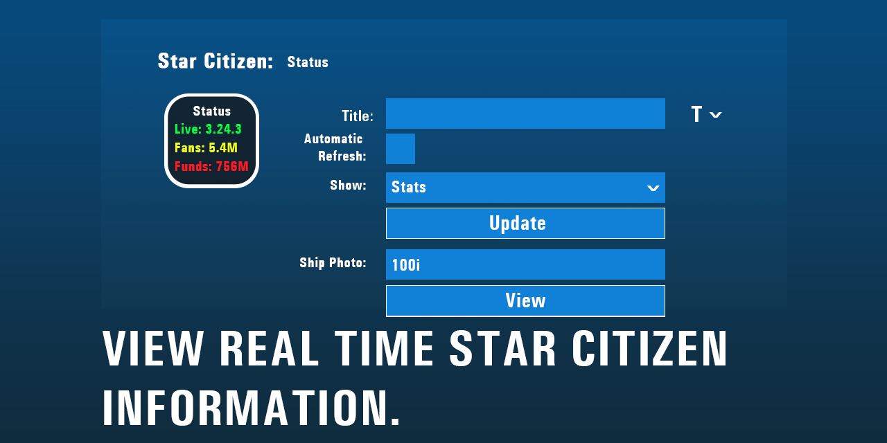

# Star Citizen Status Plugin for Elgato Streamdeck

View Real Time Star Citizen Information!

Star Citizen Status is on the Elgato Marketplace! [View on Marketplace](https://marketplace.elgato.com/product/####).

## Screenshot

Please report any issues you see on the project's Github page. I welcome any feedback.

## Features

- **Customizable Display:** Choose between showing Star Citizen Stats, Star Citizen Server Status, Star Citizen User, or Star Citizen Ship Photo on as many tiles as you want.
- **Real-Time Updates:** Automatically refresh data every 5 minutes to keep your display current.
- **Error Handling:** Displays an error message or returns as `N/A,`.
- **Translations:** User interface is available in English, German, and Spanish.

## Installation

Download from the [Release Folder](Release/com.f00d4tehg0dz.star-citizen-status.streamDeckPlugin).

Double-click to install Star Citizen Status to the StreamDeck.

## Localization

The plugin supports the following languages:
- English
- German (TBD)
- Spanish (TBD)

To switch the language, adjust the language settings in the configuration file.

## Contributing

Feel free to contribute to this project by submitting issues or pull requests on the [Github page](https://github.com/f00d4tehg0dz/starcitizen-server-status-plugin-for-elgato-streamdeck).

## License

This project is licensed under the MIT License. Please look at the [LICENSE](LICENSE) file for details.

---

Thank you for using the Star Citizen Status Plugin for Elgato Streamdeck! We appreciate your feedback and support.

